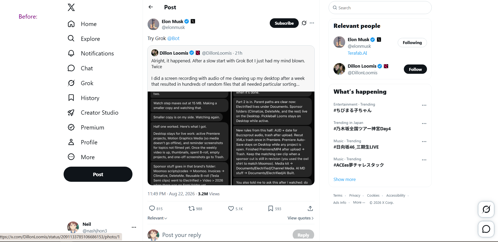
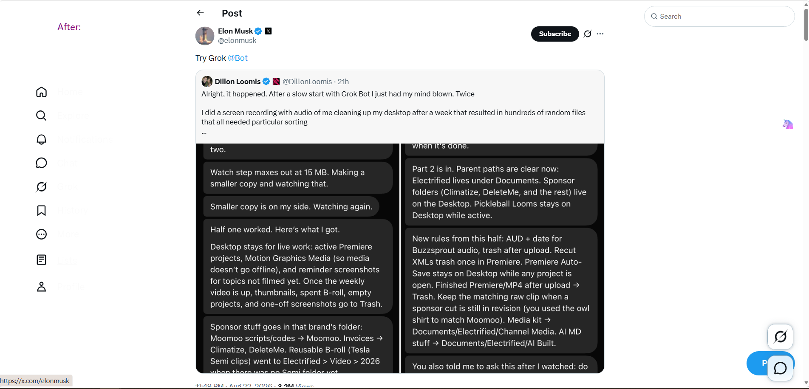
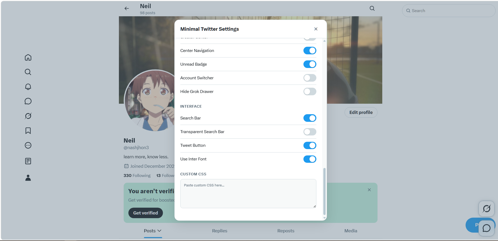

# Minimal Twitter

Minimal Twitter is a userscript that refines and cleans up the Twitter/X interface, and lets you customize your experience with a built-in settings panel — a clean, minimal theme for Twitter/X.

This script is a lightweight userscript port (简单翻版) of the Minimal Twitter **Chrome extension** by [Typefully](https://github.com/typefully/minimal-twitter) — it re-implements the extension's core features as a single Tampermonkey/Greasemonkey userscript.

## Installation

To use Minimal Twitter, you need to install a userscript manager like [Tampermonkey](https://www.tampermonkey.net/) or [Greasemonkey](https://addons.mozilla.org/en-US/firefox/addon/greasemonkey/). After installing the userscript manager, click [`here`](https://raw.githubusercontent.com/WhyWhatHow/powertoys4browser/master/js/minimal-twitter.user.js) to install the userscript.

- Works on `x.com` and `twitter.com`
- Current version: **v1.0.22**

## Screenshots

Before / after — the left navigation shrinks to icons, the timeline gets narrower and cleaner:

Settings panel (简体中文 / 繁體中文 / English):

## Usage

After installing, open any X page:

- Click the floating blue button at the bottom-right corner (can be turned off), or
- Use the Tampermonkey menu → "Minimal Twitter Settings"

The settings panel covers Timeline / Content / Navigation / Interface / Custom CSS sections. Changes apply immediately and are persisted via `GM_getValue`/`GM_setValue`.

The panel supports multiple languages (English / 简体中文 / 繁體中文). By default it follows your browser language (`Auto`), and you can switch it anytime in the **General** section.

## Default Settings

A default configuration ships with the script — it works out of the box without any setup. Defaults are applied whenever a setting has never been changed; once you toggle something, your choice is stored and survives reloads.

| Setting | Default | Description |
| --- | --- | --- |
| Timeline Width | 700px | Fixed width for the primary column (desktop) |
| Remove Timeline Borders | off | |
| Remove Tweet Borders | off | |
| Sticky Header | on | Keep the in-timeline header sticky |
| Writer Mode | off | Distraction-free writing layout |
| Default to Following Timeline | off | |
| Remove Timeline Tabs | off | |
| Hide View Count | off | |
| Remove Promoted Posts | **on** | |
| Remove Topics to Follow | **on** | |
| Follow/Reply/Retweet/Like Count | show | Per-metric hiding |
| Sidebar Logo | off | Hide the X logo in the left sidebar |
| Navigation Labels | Never show | Icon-only left nav (Never / Always / On Hover) |
| Center Navigation | off | |
| Unread Badge | off | Hide unread count badges |
| Hide Grok Drawer | **on** | |
| Search Bar | on | Plus fixed top-right positioning on wide screens |
| Tweet Button | on | Blue compose button in the left nav |
| Title Notifications | on | Show "(1)" in tab title |
| Inter Font | off | |
| Custom CSS | empty | Free-form CSS appended to the page |

### Left Navigation Buttons (visibility)

Each recognizable left-nav entry has an on/off switch in the **Navigation → Sidebar Buttons** area. Unrecognized entries are never touched.

| Button | Default | Note |
| --- | --- | --- |
| Home / Explore / Notifications / Messages / Grok | **on** | |
| Communities / Profile / Bookmarks / Lists | **on** | Lists is pinned into the nav by the script |
| Premium (X Premium) | off | Hidden by default; excludes `premium_signups` links |
| Verified Orgs / Jobs / Topics / Articles | off | Hidden by default |
| Creator Center / Creator Studio | **on** | Identified by href/testid, with an aria-label & text fallback |
| Account Switcher (avatar) | **on** | The avatar at the bottom of the left nav |

### Default Navigation Order

No reordering is applied to enabled buttons — they keep X's native positions. The only change: **Profile is moved to the very bottom** of the left nav, right above the account switcher.

## Highlights

- **Grok-safe layout**: all structural CSS overrides are scoped away from Grok pages (`/i/grok`) via a root marker class, so the chat layout is not broken. The left-nav Post button and floating tweet button are hidden there.
- **SPA-friendly**: settings re-apply automatically as X re-renders (MutationObserver driven).
- **i18n settings panel**: English / 简体中文 / 繁體中文, auto-detected.
- **Optional settings button**: the floating button can be hidden; the panel stays reachable from the userscript menu.

## Changelog

- **v1.0.22** — Treat `/i/chat` routes (chat / pin recovery, the new Grok chat path) as Grok routes: layout overrides are exempted and the injected Lists item / Profile move are skipped on all compact-sidebar routes (chat, Grok, messages) — no stray "Lists" label, no scrollbar.
- **v1.0.21** — Fix scrollbar appearing at the bottom of the left nav on `/messages`: stop injecting the Lists item and stop moving Profile there (nav stays native on the compact DM layout), and hide the nav scrollbar on that page.
- **v1.0.20** — Declare `@license MIT` in script metadata (required by GreasyFork).
- **v1.0.19** — Localized metadata: `@name:zh` / `@description:zh` for Chinese users (GreasyFork display).
- **v1.0.18** — Fix left-nav layout breaking after clicking the Messages/chat button: DM-page sidebar styles now apply on SPA navigation (history `pushState`/`replaceState` hook), and fixed-position nav styles are no longer re-added on `/messages` where they conflict with the flex layout.
- **v1.0.17** — Hide icon-less left-nav entries (e.g. Articles) automatically; entries regain visibility if X adds an icon.
- **v1.0.16** — Fix Creator Studio detection (selector chain + aria-label/text fallback); remove custom ordering; default order keeps native positions and moves Profile to the bottom.
- **v1.0.15** — (superseded) custom nav ordering.
- **v1.0.14** — Settings panel i18n; configurable floating settings button.
- **v1.0.13** — Grok route scoping fixes; full navigation visibility switches (Premium, Verified Orgs, Jobs, Topics, Articles, Creator Center); account switcher visibility.

## Contribution

If you find any issues or have any suggestions for this userscript, feel free to open an issue or submit a pull request on [GitHub](https://github.com/whywhathow/powertoys4browser).

## License

This userscript is licensed under the [MIT License](https://github.com/whywhathow/powertoys4browser/blob/main/LICENSE).
